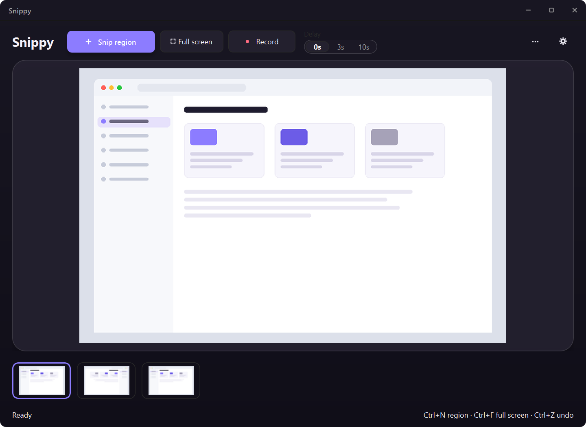
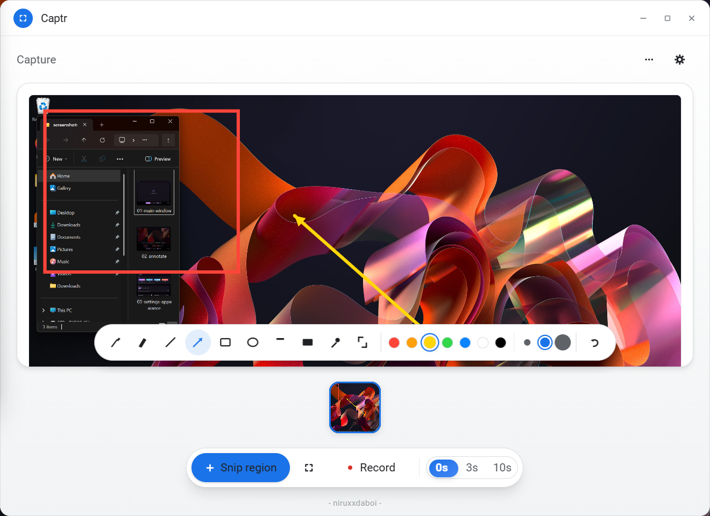
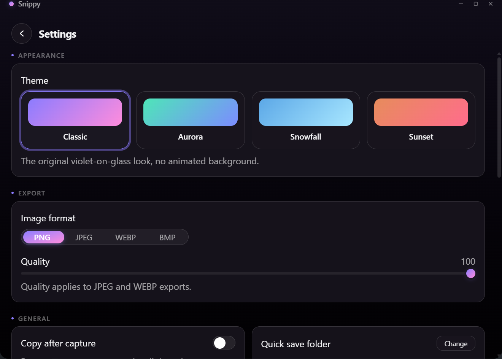

# Captr - Screenshot & Screen Recording Studio

A screenshot, annotation, and screen-recording desktop app with a frameless, translucent "glass" UI. Capture a region or the full screen, annotate it, keep a history of recent captures, and record your desktop, a single monitor, or one window to video. Built Windows-first; also builds and runs on Linux (X11, XWayland, and partially native Wayland), with a few platform gaps noted in [Known Gaps](#known-gaps--future-work).

Built with **Tauri 2**, a **Rust** backend, and a **React 19 + TypeScript + Tailwind CSS v4** frontend.



## Getting the app

There are no pre-built installers published yet — Captr is currently build-from-source only. See [Setup](#setup) below to build it yourself; a release pipeline may come later.

## Features

### Capture
- **Region capture**: dimmed fullscreen overlay with a crosshair cursor and a live width × height readout while you drag
- **Full-screen capture**: grabs every monitor at once, multi-monitor aware
- **Delay timer**: 0s / 3s / 10s countdown before a capture fires, for grabbing menus or hover states
- **Capture history**: keeps your last N captures (4/8/16/24, configurable in Settings → General) in a thumbnail rail — click one to switch back to it, or remove it individually
- **Capture sound**: an optional shutter-click on every new capture (Settings → General)

### Annotate
- **10 tools**: pen, highlighter, line, arrow, rectangle, ellipse, text, redact/pixelate, color picker, and crop
- **Redact / pixelate**: drag over sensitive content to mosaic it out before sharing — baked into the image, undoable like any other tool
- **Color picker (eyedropper)**: click any pixel in the capture to sample its color — sets it as the active annotation color and copies the hex code to the clipboard
- **7 preset colors** and **3 stroke widths**, picked from swatches in the toolbar
- **Undo**: up to 8 steps back (`Ctrl+Z`), per capture

### Export & Clipboard
- **Save As** or **Quick Save** (one click into a configured folder, auto-timestamped filename)
- **Copy to clipboard**, with an optional **auto-copy every new capture** toggle
- **4 export formats**: PNG, JPEG, WEBP, BMP, with an adjustable quality slider for the lossy ones (JPEG/WEBP)

### HDR
- **HDR display detection**: Settings shows whether each connected display is currently running in HDR mode (Windows 10 1903+)
- **Washed-out capture correction**: an opt-in toggle applies a brightness/contrast/saturation lift to new captures taken while a display is in HDR mode, since the capture path this app uses only ever sees Windows' SDR-referenced blend rather than the display's boosted brightness — a heuristic fix, not a physically accurate tone-map (there's no real HDR pixel data available to map from)

### Screen Recording
- Record the **entire desktop**, **one specific monitor**, or **a single window** (picked from a live list each time you hit Record, and followed automatically if it moves or resizes)
- **4 output containers**: MP4, MKV, FLV, WebM, encoded via a bundled ffmpeg sidecar
- **Frame rate presets from 15 up to 240 fps** (to match high-refresh-rate displays), or any custom value via `settings.json`
- **Pause / resume** mid-recording — paused time is excised entirely, not frozen or gapped in the output
- A small floating, **draggable** control bar (timer, pause, stop) that's genuinely excluded from the recording itself via `SetWindowDisplayAffinity`
- **Global hotkeys** for start/stop and pause/resume that work even when Captr isn't the focused window
- **Show cursor in recordings**: an opt-in toggle composites the live mouse cursor into recorded frames (off by default, since xcap's own capture never includes it) — stills are unaffected

### Look & Feel
- **Automatic light/dark theme** that follows the Windows appearance setting and switches live, no restart needed
- **4 accent themes** — Classic (violet-on-glass, no animated background), Aurora, Snowfall, and Sunset — each pairing an accent color with its own animated background, switchable anytime in Settings → Appearance and applied to every window including the titlebar
- Frameless, translucent **"glass" window** with custom traffic-light window controls, centered on screen at launch
- **First-run onboarding**: a short welcome → theme picker → quick-save-folder flow shown once, on the very first launch
- Capture and recording controls are docked in a **bottom action bar** so the preview canvas gets the most screen space
- **Fade-in on launch, fade-out on close**, and sliding transitions between the main and Settings views
- Per-monitor DPI aware, so region capture and UI scaling stay pixel-accurate on HiDPI/mixed-DPI setups

### Background & Startup
- **Launch at startup**: registers Captr to start automatically on sign-in (Settings → General), via the OS's own startup mechanism — not mirrored into `settings.json`, so it can't drift out of sync with what's actually registered
- **Minimize to tray**: an opt-in toggle makes closing the window hide it to a tray icon instead of quitting, so global hotkeys and an in-progress recording keep working with no window open — bring it back from the tray icon (left-click or "Show Captr"), or "Quit" from there to exit for real

## Prerequisites

- [Node.js](https://nodejs.org/) 18+
- [Rust](https://www.rust-lang.org/tools/install) (stable toolchain, via `rustup`)
- On Windows: the [Microsoft C++ Build Tools](https://visualstudio.microsoft.com/visual-cpp-build-tools/) (Tauri's MSVC toolchain requirement) and [WebView2](https://developer.microsoft.com/microsoft-edge/webview2/) (preinstalled on current Windows 10/11)
- On Linux: Tauri's own [system dependencies](https://tauri.app/start/prerequisites/#linux) (`webkit2gtk`, `libappindicator`, `librsvg`, etc.) plus `clang`/`libclang` and `pipewire`'s dev headers, both needed by `xcap` (the capture crate) to build its Wayland portal support — e.g. on Fedora: `sudo dnf install webkit2gtk4.1-devel openssl-devel curl wget file libappindicator-gtk3-devel librsvg2-devel patchelf rpm-build dpkg clang-devel pipewire-devel`
- A static `ffmpeg` binary for the screen-recording sidecar:
  - Windows: download a build from [gyan.dev](https://www.gyan.dev/ffmpeg/builds/) and place `ffmpeg.exe` at `src-tauri/binaries/ffmpeg-x86_64-pc-windows-msvc.exe`
  - Linux: download a static build from [johnvansickle.com](https://johnvansickle.com/ffmpeg/) and place it at `src-tauri/binaries/ffmpeg-x86_64-unknown-linux-gnu` (`chmod +x`)

  (Excluded from git via `.gitignore` on every platform — it's ~100-230MB. The app builds and runs without it, just without screen recording.)

## Setup

```bash
git clone https://github.com/niruxx/Captr-Snippy.git
cd Captr-Snippy
npm install
```

## Usage

### Development

Runs the app with hot-reload against the Vite dev server:

```bash
npm run tauri dev
```

### Production build

```bash
npm run tauri build
```

This compiles the Rust backend in release mode, bundles the frontend, and produces a Windows installer (NSIS `.exe` and MSI) plus a standalone `captr.exe` under `src-tauri/target/release/bundle/`. The standalone `.exe` at `src-tauri/target/release/captr.exe` can also be run directly without installing.

### Capturing a Screenshot

1. Pick a delay (**0s** / **3s** / **10s**) next to the capture buttons if you need a moment to set up what you're capturing
2. Click **＋ Snip region** (`Ctrl+N` / `PrintScreen`) to drag-select an area, or **Full screen** (`Ctrl+F`) to grab everything at once
3. The capture appears in the preview and is added to the history rail at the bottom
4. **Annotate** it with the toolbar: pick a tool, then a color and stroke width, and draw directly on the preview; `Ctrl+Z` undoes the last edit
5. **Save As** (`Ctrl+S`) to choose a location and format, or **Quick save** (`Ctrl+Q`) to save straight into your configured folder
6. **Copy** (`Ctrl+C`) to put it on the clipboard, or turn on **Copy after capture** in Settings to do that automatically every time
7. **Remove capture** (`Delete`) to drop the current one from history; click any thumbnail in the rail to switch back to an earlier capture



### Recording Your Screen

1. Open **Settings → Screen Recording** and choose:
   - **Record source**: **Entire desktop**, a specific **Monitor N**, or **Choose window** (you'll be asked which open window each time you hit Record)
   - **Video format**: MP4, MKV, FLV, or WebM
   - **Frame rate**: a preset from 15-240 fps (match your display's refresh rate for the smoothest capture)
2. Click **⏺ Record** (or press `Ctrl+Alt+R`) to start
3. Captr's window hides and a small floating control bar appears with a timer, pause/resume, and stop buttons — drag it anywhere, it won't show up in the recording
4. Use the bar's pause button, or `Ctrl+Alt+P`, to pause and resume — paused time is not included in the output
5. Click stop, or `Ctrl+Alt+R` again, to finish; the recording is saved into your Quick save folder

### Keyboard Shortcuts

The same list is also shown in-app under **Settings → Shortcuts**.

| Shortcut | Action |
| --- | --- |
| `Ctrl+N` or `PrintScreen` | Start a region capture |
| `Ctrl+F` | Start a full-screen capture |
| `Esc` | Cancel the capture overlay |
| `Ctrl+S` | Save As... |
| `Ctrl+Q` | Quick save |
| `Ctrl+C` | Copy capture to clipboard |
| `Ctrl+Z` | Undo last annotation |
| `Delete` | Remove the current capture from history |
| `Ctrl+Alt+R` | Start / stop screen recording (global — works even when Captr isn't focused) |
| `Ctrl+Alt+P` | Pause / resume screen recording (global) |



## Configuration (`settings.json`)

Every setting in the Settings screen is persisted to `settings.json` in the app's per-user config directory (`%APPDATA%\com.captr.desktop\settings.json` on Windows), and the file can be hand-edited too — each key is validated independently on load, so an edit it doesn't understand for one key still keeps the rest intact.

| Key | GUI control? | Values / notes |
| --- | --- | --- |
| `theme` | Yes (Settings → Appearance) | `"classic"`, `"aurora"`, `"snowfall"`, or `"sunset"` |
| `onboarding_complete` | No (set automatically) | `true`/`false` — whether the first-run onboarding flow has been completed or skipped |
| `export_format` | Yes (Settings → Export) | `"PNG"`, `"JPEG"`, `"WEBP"`, or `"BMP"` |
| `quality` | Yes (Settings → Export) | `40`-`100`; only applies to JPEG/WEBP exports |
| `auto_copy` | Yes (Settings → General) | `true`/`false` — copy every new capture to the clipboard automatically |
| `quick_save_dir` | Yes (Settings → General) | Folder Quick Save and recordings are written into |
| `video_format` | Yes (Settings → Screen Recording) | `"MP4"`, `"MKV"`, `"FLV"`, or `"WEBM"` |
| `record_fps` | Yes (presets), but any value works | The Frame Rate control offers common presets (15-240); set any other positive integer directly in the file (e.g. to match an odd monitor refresh rate) and it shows up as an extra option, selected |
| `record_source` | Yes (Settings → Screen Recording) | `"all"` (entire desktop), `"monitor:<index>"` (0-based, matching the Monitor N list shown in Settings), or `"window"` (asks each time you hit Record) |
| `record_scale` | **JSON only** | `0.1`-`1.0` (default `1.0`) — downscales every captured frame before encoding. Recording at a smaller size is faster end-to-end (capture, encode, and file size); worth lowering if recording still feels choppy on your hardware |
| `record_extra_ffmpeg_args` | **JSON only** | A list of extra raw ffmpeg args appended to the encode command, e.g. `["-b:v", "4M"]` for a fixed bitrate. Advanced/power-user use — invalid args will make recording fail to start |
| `hdr_tone_map` | Yes (Settings → HDR Capture) | `true`/`false` — apply a brightness/contrast/saturation correction to captures taken while a display is in HDR mode |
| `capture_sound` | Yes (Settings → General) | `true`/`false` — play a shutter-click sound on every new capture |
| `history_limit` | Yes (Settings → General) | `1`-`50` (default `8`) — thumbnails kept in the capture history rail |
| `close_to_tray` | Yes (Settings → General) | `true`/`false` — closing the window hides it to the tray instead of quitting |
| `record_cursor` | Yes (Settings → Screen Recording) | `true`/`false` — composite the live mouse cursor into recorded video frames |

"Launch at startup" isn't in this table — it's not stored in `settings.json` at all. It's backed directly by the OS's own startup-registration mechanism (queried/toggled live via Settings → General), so there's nothing here that could go stale relative to what's actually registered.

## Technical Details

- **Shell**: [Tauri 2](https://v2.tauri.app/) — a Rust-backed webview app, not Electron/Chromium-bundled
- **Backend**: Rust, using `xcap` for screenshot capture, `windows-rs` for Win32 monitor/window enumeration, `SetWindowDisplayAffinity`, and HDR `DisplayConfig` queries, and the `image`/`webp` crates for PNG/JPEG/WEBP/BMP encoding
- **Frontend**: React 19 + TypeScript, styled with Tailwind CSS v4, state managed with Zustand
- **Annotation engine**: a dual-`<canvas>` setup (a base canvas holding committed edits, an overlay canvas for the live drag preview) drawn at the capture's native pixel resolution
- **Screen recording**: frames are grabbed on a background thread and piped via a genuinely blocking stdin write into a bundled `ffmpeg` sidecar process — the blocking write is what gives the pause/resume/backpressure timing its accuracy (a full pipe naturally throttles frame production to what ffmpeg can keep up with)
- **DPI awareness**: the app manifest declares `PerMonitorV2` DPI awareness (set in `src-tauri/build.rs`), so Win32 coordinate queries (window/monitor enumeration, the region-capture overlay) get real, unscaled pixel coordinates on HiDPI and mixed-DPI setups
- **Windows-only**: this app relies on Win32 APIs throughout (window/monitor enumeration, capture-exclusion, HDR detection, global hotkeys) and isn't built or tested for macOS/Linux

## Known Gaps / Future Work

- GPU-accelerated capture (DXGI Desktop Duplication) — currently uses BitBlt-class capture via `xcap`; a GPU-accelerated path is a possible fast-follow for smoother high-fps recording
- macOS support
- Linux platform gaps (builds and runs, via X11/XWayland, with partial native-Wayland support):
  - Native-Wayland-only windows (no XWayland surface) don't appear in the "record a window" picker — Wayland gives no app permission to list other clients' windows; there's no userspace fix short of a compositor-mediated portal
  - The floating record-control bar can't be truly excluded from its own recording — `SetWindowDisplayAffinity` is a Windows-compositor feature with no X11/Wayland equivalent — but it does auto-reposition to just outside the captured region when recording a specific window or monitor, so in practice it only ends up in frame when recording the entire desktop (nowhere to move it to) or when the captured region leaves no room above or below it
  - HDR display detection works on Wayland compositors that support the `color-management-v1` protocol (recent KDE/KWin and GNOME/Mutter) by reading each output's transfer function; on X11 (which predates HDR and has no color-state protocol) or older/other compositors it reports "unknown", same as the Windows pre-1903 fallback
  - Live cursor compositing in recordings only works under X11/XWayland (via the XFixes extension); native Wayland sessions won't show the cursor in recordings
- No automated release pipeline yet — no CI builds installers or publishes them to GitHub Releases, so build-from-source is the only way to get the app for now

## License

This project is open source and available under the MIT License.

## Contributing

Contributions are welcome! Feel free to fork, make improvements, and submit pull requests.
