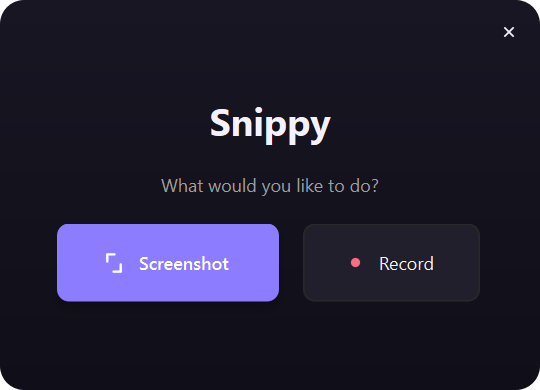
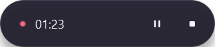
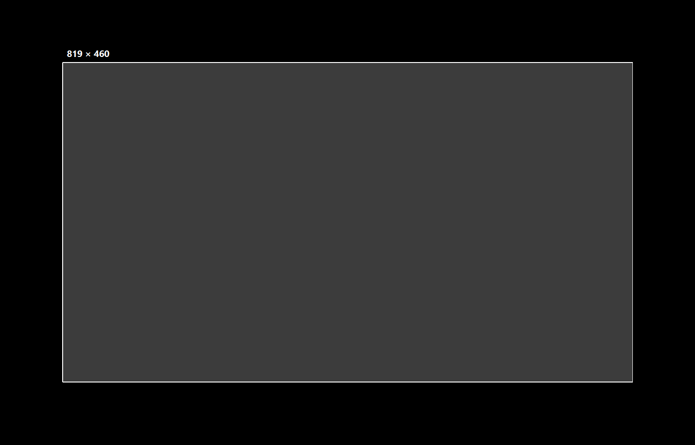
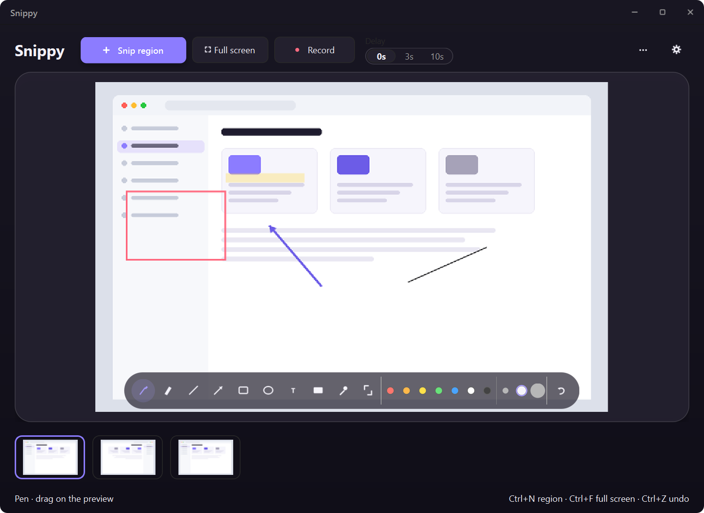
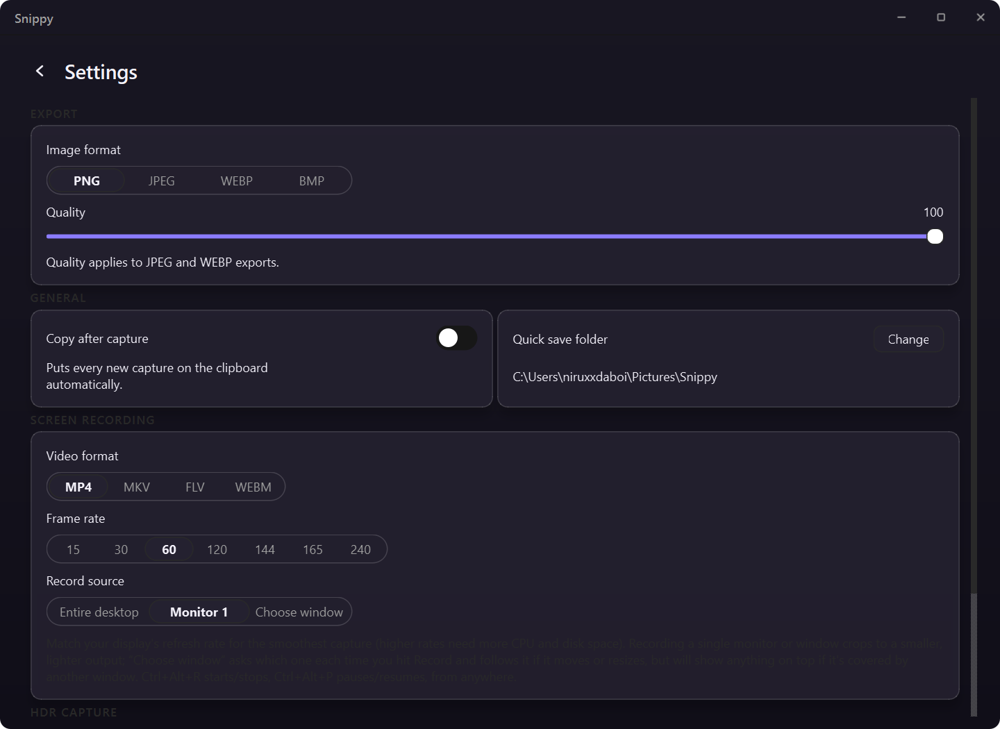
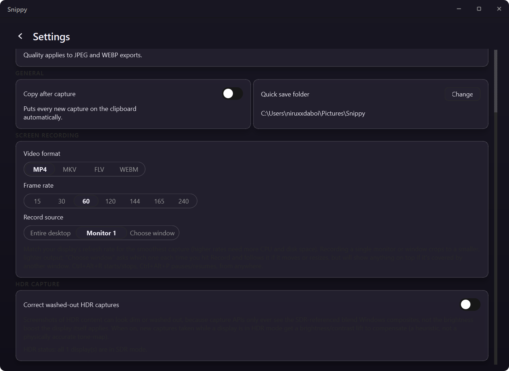

# Snippy - Screenshot & Screen Recording Studio

A Python/PySide6 (Qt) screenshot and screen-recording tool with a modern, minimal, glass-and-violet UI. Capture a region or the full screen, annotate it, keep a history of recent captures, and record your desktop, a single monitor, or one window to video — all from one lightweight app with no cloud account or install-heavy dependencies.

It's meant as a fast, always-available alternative to the Windows Snipping Tool or a paid capture app: something you can launch in a second to grab a region, mark it up, and drop it into a bug report, a chat message, or a how-to doc, or to record a quick screen-capture walkthrough — without signing into anything or paying for a subscription.


Launch it and you land on a small picker first — pick **Screenshot** or **Record** and it takes you straight into that flow, rather than dropping you into the full window before you've said what you're there to do:



## Features

### Capture
- 🎯 **Region capture**: dimmed fullscreen overlay with a crosshair cursor and a live width × height readout while you drag
- 🖥️ **Full-screen capture**: grabs every monitor at once, multi-monitor aware
- ⏱️ **Delay timer**: 0s / 3s / 10s countdown before a capture fires, for grabbing menus or hover states
- 🗂️ **Capture history**: keeps your last 8 captures in a thumbnail rail — click one to switch back to it, or remove it individually

### Annotate
- ✏️ **10 tools**: pen, highlighter, line, arrow, rectangle, ellipse, text, redact/pixelate, color picker, and crop
- 🩹 **Redact / pixelate**: drag over sensitive content to mosaic it out before sharing — baked into the image, undoable like any other tool
- 🎨 **Color picker (eyedropper)**: click any pixel in the capture to sample its color — sets it as the active annotation color and copies the hex code to the clipboard
- 🎨 **7 preset colors** and **3 stroke widths**, picked from swatches on a floating contextual toolbar that only appears once there's something to annotate
- ↩️ **Undo**: up to 8 steps back (`Ctrl+Z`), per capture

### Export & Clipboard
- 💾 **Save As** or **Quick Save** (one click into a configured folder, auto-timestamped filename)
- 📋 **Copy to clipboard**, with an optional **auto-copy every new capture** toggle
- 🖼️ **4 export formats**: PNG, JPEG, WEBP, BMP, with an adjustable quality slider for the lossy ones (JPEG/WEBP)

### HDR
- 🌈 **HDR display detection**: Settings shows whether each connected display is currently running in HDR mode (Windows 10 1903+)
- ✨ **Washed-out capture correction**: an opt-in toggle applies a brightness/contrast/saturation lift to new captures taken while a display is in HDR mode, since both capture paths this app uses only ever see Windows' SDR-referenced blend rather than the display's boosted brightness — a heuristic fix, not a physically accurate tone-map (there's no real HDR pixel data available to map from)

### Screen Recording
- 🎥 Record the **entire desktop**, **one specific monitor**, or **a single window** (picked from a live list each time you hit Record, and followed automatically if it moves or resizes)
- ⚡ **GPU-accelerated capture** via the Windows Desktop Duplication API (`bettercam`) for much smoother, higher-fps recording than plain screen-scraping — falls back automatically and silently to standard capture on macOS/Linux, over Remote Desktop, or if the GPU path isn't available for any other reason
- 📼 **4 output containers**: MP4, MKV, FLV, WebM
- 🏎️ **Frame rate presets from 15 up to 240 fps** (to match high-refresh-rate displays), or any custom value via `settings.json`
- ⏯️ **Pause / resume** mid-recording — paused time is excised entirely, not frozen or gapped in the output
- 🎛️ A small floating, **draggable** control bar (timer, pause, stop) that's genuinely excluded from the recording itself and has real transparent (not just square-cut) corners

  

- ⌨️ **Global hotkeys** for start/stop and pause/resume that work even when Snippy isn't the focused window

### Look & Feel
- 🚪 **Landing page**: a small, compact picker (Screenshot / Record) shown on launch, instead of dropping straight into the full window
- 🎨 **A single violet/indigo accent** drives every "active" state — buttons, toggles, selection — rather than mixing separate colors, for a coherent, DTK-inspired look
- 🖼️ **Hand-drawn vector icon set**: every icon (tools, titlebar, record bar) is rendered with `QPainter`, not a Unicode glyph/emoji font, so it stays crisp and consistent across systems
- 📄 **Single-page main view**: the annotation toolbar only floats into view once there's something to annotate, and less-central actions (Save As, Quick Save, Copy, Remove) live behind one **···** overflow menu, keeping the header itself minimal
- 🌗 **Automatic light/dark theme** that follows the Windows appearance setting and switches live, no restart needed
- 🪟 Frameless, translucent glass window with flat, minimal window controls and genuinely anti-aliased rounded corners (no pixelated/staircased edges, even at a small corner radius)
- ✨ **Fade-in on launch, fade-out on close**, and sliding transitions between the main and Settings views
- 🖱️ **HiDPI-aware**: Qt's native per-monitor scaling means the whole UI adapts live if you drag the window to a monitor with a different display scale
- 📐 **Compact by design**: a smaller window and tighter controls than a typical capture tool, so it doesn't dominate your screen while you're marking something up

## Installation

### Prerequisites
- Python 3.7+
- pip (Python package manager)

### Setup

1. Clone or download this repository, then `cd` into it:
   ```bash
   cd Snippy-Evolved
   ```

2. Install dependencies:
   ```bash
   pip install -r requirements.txt
   ```
   (On Windows this also installs the optional GPU-accelerated capture packages; see [Dependencies](#dependencies).)

## Usage

### Running the Application

```bash
python main.py
```

### Launching Snippy

Snippy opens on a small landing page first — pick **Screenshot** to jump straight into a region capture, or **Record** to start recording immediately. Closing the landing page (its **×** button) without picking either quits the app.

### Capturing a Screenshot

1. Pick a delay (**0s** / **3s** / **10s**) next to the capture buttons if you need a moment to set up what you're capturing
2. Click **＋ Snip region** (or `Ctrl+N` / `PrintScreen`) to drag-select an area, or **Full screen** (`Ctrl+F`) to grab everything at once

   

3. The capture appears in the preview and is added to the history rail at the bottom
4. **Annotate** it with the floating toolbar that appears over the preview: pick a tool, then a color and stroke width, and draw directly on the preview; `Ctrl+Z` undoes the last edit

   

5. **Save As** (`Ctrl+S`) to choose a location and format, or **Quick save** (`Ctrl+Q`) to save straight into your configured folder
6. **Copy** (`Ctrl+C`) to put it on the clipboard, or turn on **Copy after capture** in Settings to do that automatically every time
7. **Remove capture** (`Delete`) to drop the current one from history; click any thumbnail in the rail to switch back to an earlier capture

Save As, Quick Save, Copy, and Remove capture also live in the **···** overflow menu next to Settings, if you'd rather click than use the shortcuts.

### Recording Your Screen

1. Open **Settings → Screen Recording** and choose:
   - **Record source**: **Entire desktop**, a specific **Monitor N**, or **Choose window** (you'll be asked which open window each time you hit Record)
   - **Video format**: MP4, MKV, FLV, or WebM
   - **Frame rate**: a preset from 15-240 fps (match your display's refresh rate for the smoothest capture)
2. Click **Record** (or press `Ctrl+Alt+R`) to start
3. Snippy's window hides and a small floating control bar appears with a timer, pause/resume, and stop buttons — drag it anywhere, it won't show up in the recording
4. Use the bar's pause button, or `Ctrl+Alt+P`, to pause and resume — paused time is not included in the output
5. Click stop, or `Ctrl+Alt+R` again, to finish; the recording is saved into your Quick save folder

### Keyboard Shortcuts

| Shortcut | Action |
| --- | --- |
| `Ctrl+N` or `PrintScreen` | Start a region capture |
| `Ctrl+F` | Start a full-screen capture |
| `Esc` | Cancel the capture overlay |
| `Ctrl+S` | Save As... |
| `Ctrl+Q` | Quick save |
| `Ctrl+C` | Copy capture to clipboard |
| `Ctrl+Z` | Undo last annotation |
| `Delete` | Remove the current capture from history |
| `Ctrl+Alt+R` | Start / stop screen recording (global — works even when Snippy isn't focused) |
| `Ctrl+Alt+P` | Pause / resume screen recording (global) |

## Configuration (`settings.json`)

Every setting in the Settings screen is persisted to `settings.json` next to `main.py`, and the file can be hand-edited too — Snippy validates each key independently on load, so an edit it doesn't understand for one key still keeps the rest intact. A couple of knobs are **only** available by editing the file directly (no GUI control, to keep Settings uncluttered):

The Settings screen is one scrollable page, grouped by section:





| Key | GUI control? | Values / notes |
| --- | --- | --- |
| `export_format` | Yes (Settings → Export) | `"PNG"`, `"JPEG"`, `"WEBP"`, or `"BMP"` |
| `quality` | Yes (Settings → Export) | `40`-`100`; only applies to JPEG/WEBP exports |
| `auto_copy` | Yes (Settings → General) | `true`/`false` — copy every new capture to the clipboard automatically |
| `quick_save_dir` | Yes (Settings → General) | Folder Quick Save and recordings are written into |
| `video_format` | Yes (Settings → Screen Recording) | `"MP4"`, `"MKV"`, `"FLV"`, or `"WEBM"` |
| `record_fps` | Yes (presets), but any value works | The Frame Rate control offers common presets (15-240); set any other positive integer directly in the file (e.g. to match an odd monitor refresh rate) and it shows up as an extra option, selected |
| `record_source` | Yes (Settings → Screen Recording) | `"all"` (entire desktop), `"monitor:<index>"` (0-based, matching the Monitor N list shown in Settings), or `"window"` (asks each time you hit Record) |
| `record_scale` | **JSON only** | `0.1`-`1.0` (default `1.0`) — downscales every captured frame before encoding. Recording at a smaller size is faster end-to-end (capture, encode, and file size); worth lowering if recording still feels choppy on your hardware |
| `record_extra_ffmpeg_args` | **JSON only** | A list of extra raw ffmpeg args appended to the encode command, e.g. `["-b:v", "4M"]` for a fixed bitrate. Advanced/power-user use — invalid args will make recording fail to start |
| `hdr_tone_map` | Yes (Settings → HDR Capture) | `true`/`false` — apply a brightness/contrast/saturation correction to captures taken while a display is in HDR mode |

## Technical Details

- **GUI**: PySide6 (Qt) — custom-painted widgets (segmented control, toggle switch, color/width swatches) for the parts Qt has no native equivalent for, a hand-drawn vector icon set rendered with `QPainter`, and QSS for everything else; all re-themed live via one shared stylesheet rather than rebuilding the widget tree
- **Image processing**: Pillow (PIL) for annotation drawing, thumbnailing, and export
- **Screenshot capture**: PIL `ImageGrab` (native on Windows/macOS; uses `gnome-screenshot`, `grim`, or `spectacle` on Linux if Pillow wasn't built with XCB support)
- **Screen recording**: frames are piped into a bundled static `ffmpeg` binary (via `imageio-ffmpeg`, no system ffmpeg install required); capture itself uses the Windows Desktop Duplication API when available, falling back to `ImageGrab`-based capture otherwise
- **Clipboard**: `QClipboard`, one cross-platform call for every OS
- **Cross-platform**: Windows, macOS, Linux — see [Platform Notes](#platform-notes) for what's Windows-exclusive

## Dependencies

- `PySide6` - the Qt GUI toolkit the whole UI is built on
- `Pillow` - image processing, screenshot capture, and manipulation
- `imageio-ffmpeg` - bundles a per-OS static ffmpeg binary used to encode screen recordings (no system ffmpeg install required)
- `bettercam` + `opencv-python-headless` *(Windows only, optional)* - GPU-accelerated screen capture via the Desktop Duplication API; recording works fine without them, just via slower CPU-based capture

On Linux you'll also want one CLI tool from each pair on your `PATH` (install via your package manager):
- **Screenshot capture**: `gnome-screenshot`, `grim` (Wayland), or `spectacle` — only needed if your Pillow build lacks XCB support

macOS needs nothing extra — capture goes through the built-in `screencapture`, and clipboard/recording are handled by Qt and the bundled ffmpeg respectively.

## Platform Notes

A few conveniences rely on Win32 APIs and only work on Windows; everywhere else Snippy degrades gracefully to the platform default instead of failing:

- **Global hotkeys** (`Ctrl+Alt+R` / `Ctrl+Alt+P` from anywhere, even unfocused) — Windows only, via `RegisterHotKey`. Use the in-app buttons on macOS/Linux.
- **Automatic light/dark theme following the OS setting** — reads the Windows registry; macOS/Linux always use the light theme.
- **Hiding the floating recording bar from the recording itself** — uses `SetWindowDisplayAffinity`; on macOS/Linux the control bar may appear in recordings, so move it off-screen or to a second monitor if that matters.
- **Multi-monitor region capture math** assumes Windows' virtual-screen coordinate system; single-monitor setups work everywhere.
- **Recording a specific monitor or window, and GPU-accelerated capture** — Windows only (both need `EnumDisplayMonitors`/`EnumWindows`); macOS/Linux always record the whole desktop via standard capture. GPU capture also silently falls back to standard capture on Windows itself if DXGI duplication is refused (common over Remote Desktop, some virtual displays, or older GPU drivers) — recording still works, just not accelerated.
- **HDR display detection and correction** — uses the Windows DisplayConfig API (`QueryDisplayConfig`/`DisplayConfigGetDeviceInfo`, Windows 10 1903+) to tell whether a display is actually in HDR mode; on macOS/Linux, or older Windows, this always reports "no HDR detected," so the `hdr_tone_map` correction never fires there even if the toggle is on.

The frameless window itself, its fade in/out, and the sliding Settings transition are plain Qt (`QPropertyAnimation`, `startSystemMove()`) and work the same on every platform Qt supports; only the items above are genuinely Windows-specific.

## Troubleshooting

### "No capture yet" message
Make sure to capture a screenshot first with **＋ Snip region** or **Full screen**.

### Clipboard copy not working
Copying goes through Qt's `QClipboard` on every platform — if it's not working, check that your desktop environment has a working clipboard manager (mainly relevant on some minimal Linux window managers).

### Selection not showing
Make sure the capture overlay window is active (in focus) when selecting.

### Recording looks choppy or sped up
- Recording a single monitor or window is much lighter than the entire desktop — try narrowing **Record source** in Settings.
- Try a lower `record_scale` in `settings.json` (see [Configuration](#configuration-settingsjson)).
- On Windows, make sure GPU-accelerated capture isn't silently falling back — it's refused over Remote Desktop and on some virtual displays/older GPU drivers (see [Platform Notes](#platform-notes)).

## Future Enhancements

- [x] Annotation tools (draw, arrow, text)
- [x] Image editing features
- [x] Screenshot history
- [x] Hotkey support
- [x] Screen recording (pause/resume, multi-format export, global hotkeys)
- [x] Recording source selection (monitor/window) and GPU-accelerated capture
- [x] Redact/pixelate and color picker annotation tools
- [x] HDR display detection and washed-out capture correction
- [x] Full rewrite from Tkinter to PySide6/Qt, with a modern glass/DTK-inspired UI and a hand-drawn vector icon set
- [x] Landing page picker (Screenshot / Record) shown on launch

## License

This project is open source and available under the MIT License.

## Contributing

Contributions are welcome! Feel free to fork, make improvements, and submit pull requests.
